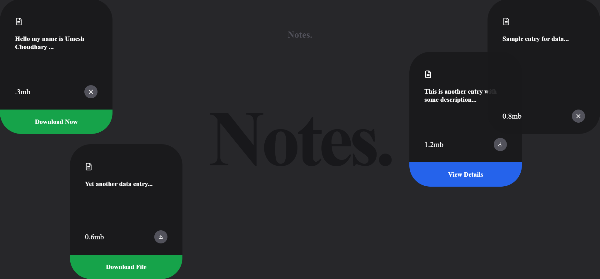

# React Notes Animated Web App

A React-based web app for creating and managing notes with smooth animated transitions using "Framer Motion".

## Features

- Enjoy smooth animated transitions for a delightful user experience.
- Responsive design ensures compatibility across devices.

## Installation

1. Clone the repository.
2. Install dependencies with `npm install`
3. Start the development server with `npm run dev`

## Technologies Used

- React Js
- Tailwind CSS for styling
- Framer motion for smooth transitions
- React Icons for icons

## License

This project is licensed under the MIT License.

## Contributing

Contributions are welcome! Feel free to open issues or pull requests.

